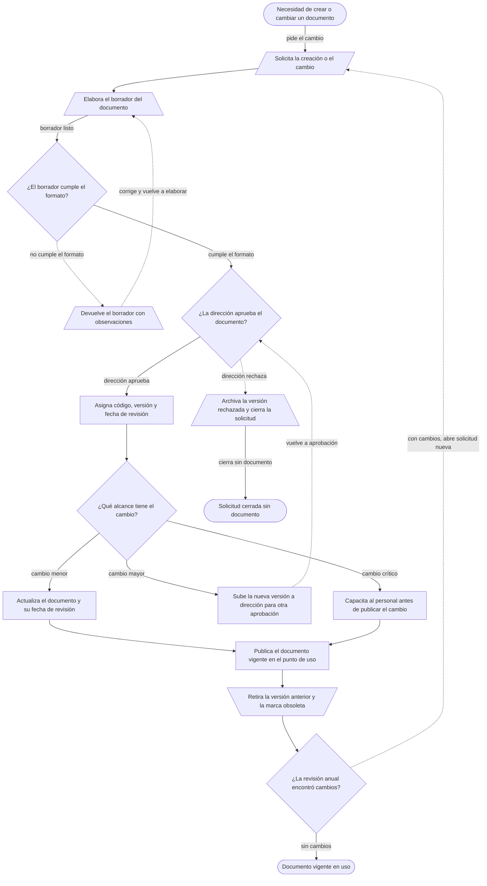

# 04, Plano real, ejemplo
Cliente: Taller de flotillas (ejemplo inventado, sin datos de ninguna empresa)
Proceso: Control de la documentación del sistema de gestión
Fase: 2, plano real
Evidencia dominante: observado
Hallazgo: El documento tarda once días en llegar al punto de uso, y ocho de esos días son espera de una firma. Nadie trabaja el documento en ese tiempo.
Entradas: necesidad de crear o cambiar un documento, formato vigente, lista de verificación de calidad
Salidas: documento aprobado y vigente en el punto de uso, versión anterior retirada y marcada obsoleta
Secuencia: se solicita el cambio, se elabora el borrador, calidad revisa el formato, dirección aprueba, se codifica y publica, se retira la versión anterior, se revisa cada año
Criterios: la revisión de formato la hace calidad, la aprobación la hace dirección, un cambio crítico exige capacitación antes de publicar
Recursos: formato de documento controlado, lista de verificación, carpeta compartida, archivo de versiones obsoletas
Responsables: calidad es dueño del proceso, dirección aprueba, el dueño del proceso elabora
Riesgos: documento obsoleto en uso por no retirarlo, cambio crítico sin capacitar, versión sin fecha de revisión
Mejora: se cuenta el mismo método cada trimestre y se compara contra la línea base
Casos caminados: caso A, 2026-09-18, con la responsable de calidad. Caso B, 2026-09-19, con dirección.
## Nodos
| id | texto | forma | quien | sistema | trabajo | espera | evidencia |
|---|---|---|---|---|---|---|---|
| n1 | Necesidad de crear o cambiar un documento | inicio | dueño del proceso | correo | 5 min | 1 d | [dicho] "casi siempre lo piden por correo o por WhatsApp" (calidad, 2026-09-18) |
| n2 | Solicita la creación o el cambio | datos | dueño del proceso | correo | 10 min | 1 d | [observado] caso A caminado con calidad, el 2026-09-18 |
| n3 | Elabora el borrador del documento | documento | dueño del proceso | Word | 2 h | 2 d | [observado] caso A caminado con calidad, el 2026-09-18 |
| n4 | ¿El borrador cumple el formato? | decision | calidad | lista de verificación | 15 min | 1 d | [observado] caso A caminado con calidad, el 2026-09-18 |
| n5 | Devuelve el borrador con observaciones | documento | calidad | correo | 20 min | 1 d | [observado] dos devoluciones en el caso A, el 2026-09-18 |
| n6 | ¿La dirección aprueba el documento? | decision | dirección | correo | 10 min | 3 d | [observado] caso B caminado con dirección, el 2026-09-19 |
| n7 | Archiva la versión rechazada y cierra la solicitud | documento | calidad | carpeta compartida | 15 min | 0 | [dicho] "cuando dirección rechaza, ahí se queda" (calidad, 2026-09-18) |
| n8 | Asigna código, versión y fecha de revisión | actividad | calidad | Excel | 10 min | 1 d | [observado] caso A caminado con calidad, el 2026-09-18 |
| n9 | ¿Qué alcance tiene el cambio? | decision | calidad | Excel | 5 min | 0 | [dicho] "el alcance lo decide quien revisa" (calidad, 2026-09-18) |
| n10 | Actualiza el documento y su fecha de revisión | actividad | dueño del proceso | Word | 40 min | 2 d | [dicho] "si es menor, lo cambio y ya" (calidad, 2026-09-18) |
| n11 | Sube la nueva versión a dirección para otra aprobación | actividad | calidad | correo | 15 min | 3 d | [observado] caso B caminado con dirección, el 2026-09-19 |
| n12 | Capacita al personal antes de publicar el cambio | actividad | calidad | sala de juntas | 1 h | 5 d | [medido] 3 casos en la ventana de 3 días, 5 d de espera promedio |
| n13 | Publica el documento vigente en el punto de uso | actividad | calidad | carpeta compartida | 20 min | 1 d | [observado] caso A caminado con calidad, el 2026-09-18 |
| n14 | Retira la versión anterior y la marca obsoleta | almacenamiento | calidad | archivo de versiones | 10 min | 0 | [observado] caso A caminado con calidad, el 2026-09-18 |
| n15 | ¿La revisión anual encontró cambios? | decision | calidad | calendario | 5 min | 0 | [dicho] "la revisión anual casi no se hace" (calidad, 2026-09-18) |
| n16 | Documento vigente en uso | fin | | | | | [observado] |
| n17 | Solicitud cerrada sin documento | fin | | | | | sin observar |
## Rutas
| desde | hacia | etiqueta | tipo |
|---|---|---|---|
| n1 | n2 | pide el cambio | normal |
| n2 | n3 | | normal |
| n3 | n4 | borrador listo | normal |
| n4 | n5 | no cumple el formato | excepcion |
| n5 | n3 | corrige y vuelve a elaborar | retrabajo |
| n4 | n6 | cumple el formato | normal |
| n6 | n7 | dirección rechaza | rechazo |
| n7 | n17 | cierra sin documento | normal |
| n6 | n8 | dirección aprueba | normal |
| n8 | n9 | | normal |
| n9 | n10 | cambio menor | normal |
| n9 | n11 | cambio mayor | normal |
| n9 | n12 | cambio crítico | normal |
| n11 | n6 | vuelve a aprobación | retrabajo |
| n10 | n13 | | normal |
| n12 | n13 | | normal |
| n13 | n14 | | normal |
| n14 | n15 | | normal |
| n15 | n16 | sin cambios | normal |
| n15 | n2 | con cambios, abre solicitud nueva | retrabajo |
## Diagrama del plano
El dibujo se genera desde las tablas de nodos y rutas y no se edita a mano.
<!-- diagrama:inicio -->

<!-- diagrama:fin -->
