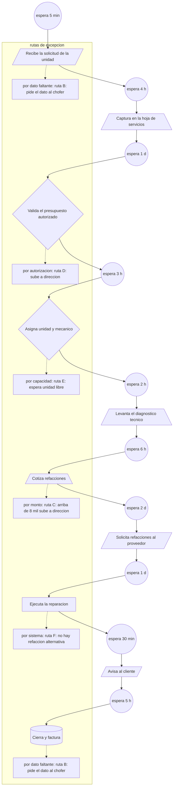

# 04, Plano real, ejemplo
Cliente: Taller de flotillas (ejemplo inventado, sin datos de ninguna empresa)
Proceso: Alta y cierre de una orden de servicio
Fase: 2, plano real
Evidencia dominante: observado
Hallazgo: El caso espera mas de un dia sin que nadie lo trabaje, y la espera no esta en el area que todos culpan.
Casos caminados: caso A, 2026-09-18, con el jefe de patio. Caso B, 2026-09-19, con el mecanico.
| id | paso | quien | sistema | forma | tipo | excepcion | ruta | trabajo | espera | evidencia |
|---|---|---|---|---|---|---|---|---|---|---|
| 1 | Recibe la solicitud de la unidad | jefe de patio | WhatsApp | datos | ejecuta | por dato faltante | ruta B: pide el dato al chofer | 5 min | 5 min | [observado] caso A caminado con el jefe de patio, el 2026-09-18 |
| 2 | Captura en la hoja de servicios | auxiliar administrativo | Excel | documento | ejecuta | ninguna | | 12 min | 4 h | [observado] caso A caminado con el jefe de patio, el 2026-09-18 |
| 3 | Valida el presupuesto autorizado | jefe de patio | Excel | decision | decide | por autorizacion | ruta D: sube a direccion | 8 min | 1 d | [observado] caso A caminado con el jefe de patio, el 2026-09-18 |
| 4 | Asigna unidad y mecanico | jefe de patio | pizarron | decision | decide | por capacidad | ruta E: espera unidad libre | 10 min | 3 h | [observado] caso A caminado con el jefe de patio, el 2026-09-18 |
| 5 | Levanta el diagnostico tecnico | mecanico | papel | documento | ejecuta | ninguna | | 45 min | 2 h | [observado] caso B caminado con el mecanico, el 2026-09-19 |
| 6 | Cotiza refacciones | compras | correo | documento | ejecuta | por monto | ruta C: arriba de 8 mil sube a direccion | 25 min | 6 h | [medido] 12 casos en la ventana de 3 dias, promedio 6 h de espera |
| 7 | Solicita refacciones al proveedor | compras | proveedor | datos | ejecuta | ninguna | | 15 min | 2 d | [dicho] "el proveedor depende de si hay credito" (compras, 2026-09-19) |
| 8 | Ejecuta la reparacion | mecanico | taller | actividad | ejecuta | por sistema | ruta F: no hay refaccion alternativa | 3 h | 1 d | [observado] caso B caminado con el mecanico, el 2026-09-19 |
| 9 | Avisa al cliente | atencion a clientes | WhatsApp | datos | ejecuta | ninguna | | 6 min | 30 min | [observado] caso A caminado con el jefe de patio, el 2026-09-18 |
| 10 | Cierra y factura | administracion | sistema contable | base-de-datos | ejecuta | por dato faltante | ruta B: pide el dato al chofer | 20 min | 5 h | sin observar |
## Diagrama del plano
El dibujo se genera desde la tabla de arriba y no se edita a mano.
<!-- diagrama:inicio -->

<!-- diagrama:fin -->
